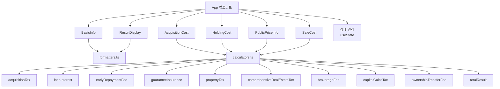

# 설계 문서: 부동산 경매 수익 계산기

## 개요

한국 부동산 경매 투자의 전체 라이프사이클(취득 → 보유 → 매도)에 걸친 비용과 세금을 계산하고, 최종 순수익 및 수익률을 산출하는 React 기반 SPA이다. 모든 세금 계산 로직은 순수 함수로 분리하여 테스트 가능성을 확보하고, UI 컴포넌트는 입력/표시 역할만 담당한다.

## 아키텍처



### 기술 스택

- React 18 + TypeScript
- Vite 6 (빌드 도구)
- 순수 CSS (외부 UI 라이브러리 없음)
- Vitest + fast-check (테스트)

### 설계 원칙

1. 계산 로직과 UI를 완전히 분리한다
2. 모든 계산 함수는 순수 함수로 구현한다 (부수 효과 없음)
3. 계산 함수는 숫자를 입력받아 숫자를 반환한다 (UI 상태 setter를 받지 않음)
4. 입력 검증은 별도 유틸리티로 분리한다

## 컴포넌트 및 인터페이스

### 계산 함수 인터페이스

모든 계산 함수는 순수 함수로, 필요한 숫자 파라미터를 받아 계산 결과 객체를 반환한다.

```typescript
// 취득세 계산
function calculateAcquisitionTax(
  bidPrice: number,
  houseCount: AcquisitionHouseCount
): AcquisitionTaxResult

// 대출이자 계산
function calculateLoanInterest(
  bidPrice: number,
  loanRatio: number,
  loanRate: number,
  holdingPeriod: number
): number

// 중도상환수수료 계산
function calculateEarlyRepaymentFee(
  bidPrice: number,
  loanRatio: number,
  earlyRepaymentRate: number
): number

// 보증보험료 계산
function calculateGuaranteeInsurance(publicPrice: number): number

// 재산세 계산
function calculatePropertyTax(publicPrice: number): PropertyTaxResult

// 종합부동산세 계산
function calculateComprehensiveRealEstateTax(
  publicPrice: number,
  houseCount: PublicPriceHouseCount
): ComprehensiveRealEstateTaxResult

// 소유권이후 관리비 계산
function calculateOwnershipTransferFee(
  monthlyManagementFee: number,
  holdingPeriod: number
): number

// 중개수수료 계산
function calculateBrokerageFee(salePrice: number): BrokerageFeeResult

// 양도소득세 계산
function calculateCapitalGainsTax(
  bidPrice: number,
  salePrice: number,
  holdingPeriod: number,
  houseType: HouseType,
  acquisitionTax: number,
  legalFee: number,
  brokerageFee: number
): CapitalGainsTaxResult

// 최종 결과 계산
function calculateTotalResult(
  bidPrice: number,
  salePrice: number,
  loanRatio: number,
  costs: AllCosts
): TotalResult
```

### UI 컴포넌트 구조

| 컴포넌트 | 역할 | 관련 요구사항 |
|---------|------|-------------|
| App | 전체 상태 관리, 계산 함수 호출 | 전체 |
| BasicInfo | 낙찰금액, 판매예상금액 입력 | 1 |
| AcquisitionCost | 취득세, 경매집행비용, 법무비, 미납관리비 | 2, 3 |
| HoldingCost | 보유기간, 인테리어, 대출, 관리비 등 | 4, 5, 6 |
| PublicPriceInfo | 공시가격, 보증보험료, 재산세, 종부세 | 7, 8, 9 |
| SaleCost | 중개수수료, 양도소득세, 지방소득세 | 10, 11 |
| ResultDisplay | 최종 결과 표시 | 12 |

## 데이터 모델

```typescript
// 주택 수 타입 (취득세용)
type AcquisitionHouseCount = '1' | '2-normal' | '2-regulated' | '3'

// 주택 수 타입 (종부세용)
type PublicPriceHouseCount = '1' | '2' | '3'

// 주택 유형 (양도세용)
type HouseType = 'individual' | 'business'

// 취득세 계산 결과
interface AcquisitionTaxResult {
  baseTax: number       // 기본 취득세
  localTax: number      // 지방교육세/농특세
  totalTax: number      // 총 취득세
  taxRate: number        // 적용 세율
  localTaxRate: number   // 지방교육세율
  description: string    // 설명
}

// 재산세 계산 결과
interface PropertyTaxResult {
  taxBase: number        // 과세표준
  baseTax: number        // 기본 재산세
  educationTax: number   // 지방교육세
  totalTax: number       // 총 재산세
}

// 종합부동산세 계산 결과
interface ComprehensiveRealEstateTaxResult {
  deduction: number      // 공제금액
  taxBase: number        // 과세표준
  tax: number            // 종부세
  isExempt: boolean      // 면제 여부
}

// 중개수수료 계산 결과
interface BrokerageFeeResult {
  baseFee: number        // 중개보수
  vat: number            // 부가가치세
  totalFee: number       // 총 수수료
  feeRate: number        // 적용 요율
  maxFee: number         // 한도액 (0이면 한도 없음)
}

// 양도소득세 계산 결과
interface CapitalGainsTaxResult {
  necessaryExpenses: number  // 필요경비
  profit: number             // 양도차익
  taxableIncome: number      // 과세표준
  capitalGainsTax: number    // 양도소득세
  localIncomeTax: number     // 지방소득세
  totalTax: number           // 총 세액
  taxRate: number            // 적용 세율 (단기보유 시) 또는 최고 적용 세율
  description: string        // 설명
}

// 전체 비용 항목
interface AllCosts {
  acquisitionTax: number
  auctionFee: number
  legalFee: number
  unpaidFee: number
  interiorCost: number
  moveInCleaning: number
  ownershipTransferFee: number
  evictionCost: number
  loanInterest: number
  earlyRepaymentFee: number
  managementFee: number
  guaranteeInsurance: number
  propertyTax: number
  comprehensiveRealEstateTax: number
  capitalGainsTax: number
  localIncomeTax: number
  brokerageFee: number
}

// 최종 결과
interface TotalResult {
  totalCost: number          // 총 비용
  totalInvestment: number    // 총 투자금액
  netProfit: number          // 순수익
  profitRate: number         // 수익률 (%)
  marketGain: number         // 시세차익
  loanAmount: number         // 경락자금대출
  cashInvestment: number     // 현금투입
}

// 누진세율 테이블
interface TaxBracket {
  limit: number    // 구간 상한 (초과 시 다음 구간)
  rate: number     // 세율
}

const PROGRESSIVE_TAX_BRACKETS: TaxBracket[] = [
  { limit: 14_000_000, rate: 0.06 },
  { limit: 50_000_000, rate: 0.15 },
  { limit: 88_000_000, rate: 0.24 },
  { limit: 150_000_000, rate: 0.35 },
  { limit: 300_000_000, rate: 0.38 },
  { limit: 500_000_000, rate: 0.40 },
  { limit: 1_000_000_000, rate: 0.42 },
  { limit: Infinity, rate: 0.45 },
]
```

### 누진세율 계산 알고리즘

```typescript
function calculateProgressiveTax(taxableIncome: number): number {
  let remainingIncome = taxableIncome
  let totalTax = 0
  let prevLimit = 0

  for (const bracket of PROGRESSIVE_TAX_BRACKETS) {
    const taxableInBracket = Math.min(remainingIncome, bracket.limit - prevLimit)
    if (taxableInBracket <= 0) break
    totalTax += taxableInBracket * bracket.rate
    remainingIncome -= taxableInBracket
    prevLimit = bracket.limit
  }

  return Math.round(totalTax)
}
```


## 정확성 속성 (Correctness Properties)

*정확성 속성(property)이란 시스템의 모든 유효한 실행에서 참이어야 하는 특성 또는 동작이다. 사람이 읽을 수 있는 명세와 기계가 검증할 수 있는 정확성 보장 사이의 다리 역할을 한다.*

### Property 1: 취득세 계산 정확성

*For any* 양수 낙찰금액과 유효한 주택 수 조합에 대해, calculateAcquisitionTax는 해당 주택 수와 금액 구간에 맞는 세율을 적용하여 baseTax = round(낙찰금액 × 취득세율), localTax = round(낙찰금액 × 지방교육세율), totalTax = baseTax + localTax를 반환해야 한다.

**Validates: Requirements 2.2, 2.3, 2.4, 2.5, 2.6, 2.7**

### Property 2: 누진세율 계산 정확성

*For any* 양수 과세표준에 대해, calculateProgressiveTax는 각 구간별 초과분에 해당 세율을 적용하여 합산한 값을 반환해야 한다. 즉, 결과는 항상 min(과세표준, 1400만) × 6% + min(max(과세표준 - 1400만, 0), 3600만) × 15% + ... 의 합과 같아야 한다.

**Validates: Requirements 11.7, 11.8, 11.9**

### Property 3: 단순 비용 계산 공식 정확성

*For any* 유효한 양수 입력값에 대해:
- calculateLoanInterest(bidPrice, loanRatio, loanRate, holdingPeriod) = round(bidPrice × loanRatio/100 × loanRate/100 × holdingPeriod/12)
- calculateEarlyRepaymentFee(bidPrice, loanRatio, rate) = round(bidPrice × loanRatio/100 × rate/100)
- calculateOwnershipTransferFee(monthlyFee, period) = round(monthlyFee × period)
- calculateGuaranteeInsurance(publicPrice) = round(publicPrice × 1.26)

**Validates: Requirements 4.4, 5.2, 6.4, 7.2**

### Property 4: 재산세 계산 정확성

*For any* 양수 공시가격에 대해, calculatePropertyTax는 과세표준(공시가격 × 60%)에 누진세율(0.1%~0.4%)을 적용하고, 지방교육세(재산세 × 20%)를 합산한 총 재산세를 반환해야 한다. 총 재산세는 항상 0 이상이어야 한다.

**Validates: Requirements 8.1, 8.2, 8.3, 8.4, 8.5, 8.6**

### Property 5: 종합부동산세 계산 정확성

*For any* 양수 공시가격과 유효한 주택 수에 대해, calculateComprehensiveRealEstateTax는 주택 수별 공제금액(1주택 12억, 2주택 9억, 3주택 6억)을 적용하고, 과세표준 = max(0, (공시가격 - 공제금액) × 60%)에 주택 수별 누진세율을 적용한 결과를 반환해야 한다. 공시가격이 공제금액 이하이면 세금은 0이어야 한다.

**Validates: Requirements 9.2, 9.3, 9.4, 9.5, 9.6, 9.7, 9.8**

### Property 6: 중개수수료 계산 정확성

*For any* 양수 판매금액에 대해, calculateBrokerageFee는 해당 금액 구간의 요율을 적용하고, 한도액이 있는 구간에서는 한도를 초과하지 않으며, 부가가치세 10%를 가산한 총 수수료를 반환해야 한다. totalFee = baseFee + round(baseFee × 0.1)이어야 한다.

**Validates: Requirements 10.1, 10.2, 10.3, 10.4, 10.5, 10.6, 10.7, 10.8**

### Property 7: 양도소득세 계산 파이프라인 정확성

*For any* 유효한 입력 조합(양수 낙찰금액, 양수 판매예상금액, 양수 보유기간, 유효한 주택유형, 양수 취득세/법무비/중개수수료)에 대해, calculateCapitalGainsTax는:
- 필요경비 = 낙찰금액 + 취득세 + 법무비 + 중개수수료
- 양도차익 = 판매예상금액 - 필요경비
- 과세표준 = max(0, 양도차익 - 250만원)
- 양도차익 > 0일 때: 보유기간과 주택유형에 따른 올바른 세율/누진세율 적용
- 지방소득세 = round(양도소득세 × 0.1)
을 만족하는 결과를 반환해야 한다.

**Validates: Requirements 11.2, 11.3, 11.4, 11.5, 11.6, 11.7, 11.8, 11.9, 11.10**

### Property 8: 최종 결과 계산 정확성

*For any* 유효한 입력 조합(양수 낙찰금액, 양수 판매예상금액, 유효한 대출비율, 유효한 비용 항목들)에 대해, calculateTotalResult는:
- totalCost = 모든 비용 항목의 합
- totalInvestment = 낙찰금액 + totalCost
- netProfit = 판매예상금액 - totalInvestment
- profitRate = round((netProfit / totalInvestment) × 100, 2) (totalInvestment > 0일 때)
- marketGain = 판매예상금액 - 낙찰금액
- loanAmount = round(낙찰금액 × 대출비율/100)
- cashInvestment = 낙찰금액 - loanAmount + totalCost - 양도소득세 - 지방소득세
를 만족하는 결과를 반환해야 한다.

**Validates: Requirements 12.1, 12.2, 12.3, 12.4, 12.5, 12.6, 12.7**

### Property 9: 숫자 포맷팅 정확성

*For any* 0 이상의 정수에 대해, formatNumber는 3자리마다 콤마를 삽입한 문자열을 반환해야 하며, 반환된 문자열에서 콤마를 제거하고 숫자로 변환하면 원래 값과 같아야 한다 (round-trip property).

**Validates: Requirements 1.5**

### Property 10: 입력 검증 정확성

*For any* 음수 값에 대해, handleNumberInput은 해당 입력을 거부하고 기존 값을 유지해야 한다. *For any* 유효한 0 이상의 정수에 대해, handleNumberInput은 해당 값을 수용해야 한다.

**Validates: Requirements 1.3, 1.4, 13.1**

## 에러 처리

| 에러 상황 | 처리 방식 |
|----------|----------|
| 자동계산 시 선행 입력값 없음 | 사용자에게 해당 입력을 요청하는 메시지 표시 |
| 대출비율 범위 초과 (0~90%) | 유효 범위 안내 메시지 표시 |
| 대출금리 범위 초과 (4~10%) | 유효 범위 안내 메시지 표시 |
| 보유기간 1개월 미만 | 보유기간 입력 요청 메시지 표시 |
| 양도차익 0 이하 | 양도소득세 0 설정, 수익 없음 안내 |
| 종부세 과세표준 0 | 종부세 0 설정, 면제 안내 |
| 비숫자/음수 입력 | 입력 무시, 기존 값 유지 |

모든 에러 메시지는 alert() 대신 UI 내 인라인 메시지로 표시하여 사용자 경험을 개선한다.

## 테스트 전략

### 단위 테스트 (Unit Tests)

- 각 계산 함수의 특정 입력에 대한 기대 출력 검증
- 경계값 테스트 (구간 경계에서의 세율 변경)
- 에러 조건 테스트 (0 입력, 범위 초과 등)
- 기본값 초기화 테스트

### 속성 기반 테스트 (Property-Based Tests)

- 라이브러리: fast-check
- 최소 100회 반복 실행
- 각 테스트에 설계 문서의 property 번호 태그 부착
- 태그 형식: **Feature: auction-calculator, Property {번호}: {속성명}**

### 테스트 범위

| 테스트 유형 | 대상 | 목적 |
|-----------|------|------|
| Property 테스트 | 계산 함수 (calculators.ts) | 모든 유효 입력에 대한 정확성 |
| Property 테스트 | 포맷터 (formatters.ts) | round-trip 정확성 |
| Unit 테스트 | 계산 함수 경계값 | 구간 경계에서의 정확성 |
| Unit 테스트 | 에러 조건 | 잘못된 입력 처리 |
| Unit 테스트 | 기본값 | 초기 상태 정확성 |
